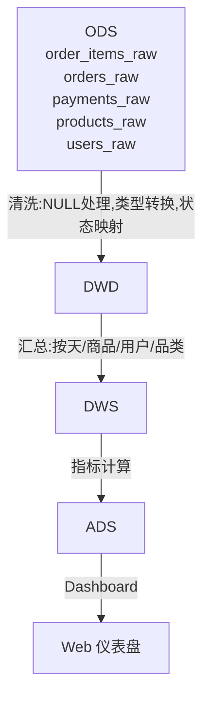

# End-to-End Data Warehouse Demo

> YMatrix 在数仓场景中的完整使用方式 — 从业务库到数仓分层再到报表展示的最小 Demo
>
> **评分目标**: 可运行性 25′ / 场景理解 20′ / 工程完整度 20′ / 测试与验证 15′ / AI 使用能力 10′ / 报告与表达 10′

---

## 目录

- [项目概述](#项目概述)
- [架构总览](#架构总览)
- [数据流](#数据流)
- [技术栈](#技术栈)
- [前置要求](#前置要求)
- [快速开始](#快速开始)
- [项目结构](#项目结构)
- [数仓分层说明](#数仓分层说明)
- [业务指标](#业务指标)
- [验证方法](#验证方法)
- [后续规划](#后续规划)
- [License](#license)

---

## 项目概述

本项目实现了一个**最小可运行的端到端数据仓库 Demo**，模拟从电商业务数据库到分析报表的完整数据链路。目标受众是希望理解 YMatrix 在数仓场景中（或任何 MPP 数据库）使用方式的客户。

**核心场景**: 电商零售
**同步方式**: 类 CDC 的增量/全量同步（Python 脚本模拟）
**数仓分层**: ODS → DWD → DWS → ADS
**指标数量**: 7 个业务指标（超过要求的 5 个）
**展示方式**: Web 交互式仪表盘（Flask + Plotly）+ SQL 查询 + Markdown 报告

**业务价值**:
- 真实 FDE 工作场景：面对客户时，用一个可复现的最小 Demo 说明 YMatrix 的数仓能力
- 端到端覆盖：从“业务库有什么”到“报表长什么样”全链路可见
- 可扩展架构：分层设计方便替换组件（MySQL → 任何源、YMatrix → 任何 MPP）

---

## 架构总览

```mermaid
flowchart LR
     subgraph Business["业务库 (MySQL/SQLite)"]
         U[(users)]
         P[(products)]
         O[(orders)]
         OI[(order_items)]
         PY[(payments)]
     end

     subgraph Sync["数据同步 (Python ETL)"]
         EX[全量抽取]
         TR[类型转换/清洗]
         LD[分层加载]
     end

     subgraph Warehouse["数据仓库 (YMatrix / PostgreSQL / SQLite)"]
         ODS[(ODS 原始同步层)]
         DWD[(DWD 清洗明细层)]
         DWS[(DWS 汇总层)]
         ADS[(ADS 应用报表层)]
     end

     subgraph Output["报表展示"]
         WEB[Web Dashboard]
         SQL[SQL 查询]
         MD[Markdown 报告]
     end

     Business --> Sync --> Warehouse
     Warehouse --> Output
```



---

## 数据流

1. **业务库初始化**: 创建 5 张电商业务表并写入示例数据
2. **数据同步**: Python 脚本从业务库抽取全部数据，写入数仓 ODS 层
3. **ODS → DWD**: 数据清洗（去空值、类型标准化、格式统一）
4. **DWD → DWS**: 多维度汇总（按天、按商品、按用户、按品类）
5. **DWS → ADS**: 计算最终业务指标的物化视图
6. **报表展示**: Flask Web 应用读取 ADS 层，通过 Plotly 渲染图表

---

## 技术栈

| 层次 | 技术 | 版本 | 用途 |
|------|------|------|------|
| 业务库 | SQLite (模拟 MySQL) | 3.x | 电商业务数据存储 |
| 数仓 | SQLite (模拟 YMatrix / PostgreSQL) | 3.x | 数仓分层存储 |
| 同步引擎 | Python + SQLAlchemy | 3.11 / 1.4.39 | 数据抽取、清洗、加载 |
| 数据处理 | Pandas + NumPy | 1.5.3 / 1.24.3 | 数据转换与聚合 |
| Web 框架 | Flask | 2.2.2 | 仪表盘后端 |
| 可视化 | Plotly | 5.9.0 | 交互式图表 |
| 模板引擎 | Jinja2 | 3.1.2 | HTML 模板渲染 |

> **说明**: 本 Demo 默认使用 SQLite 以使项目无外部依赖即可运行。SQL 语法保持与 PostgreSQL/YMatrix 兼容，切换时只需修改数据库连接字符串。

---

## 前置要求

- **Python 3.10+** (推荐 3.11)
- **pip 或 conda** (已安装 Flask、pandas、plotly、SQLAlchemy 等依赖)
- **Docker** (可选) — 如果希望用真实 MySQL + PostgreSQL 运行
- **操作系统**: Windows / macOS / Linux 均可

### 安装依赖

```bash
pip install flask pandas plotly sqlalchemy numpy jinja2
```

或使用 conda:

```bash
conda install flask pandas plotly sqlalchemy numpy
```

---

## 快速开始

### 方式一：一键运行（推荐）

```bash
cd D:\End-to-End-Data-Warehouse-Demo
python init_all.py
```

该脚本会自动完成:
1. 创建业务数据库 data/business.db 并初始化 5 张表 + 200+ 条示例数据
2. 创建数仓 data/warehouse.db 并建立 ODS / DWD / DWS / ADS 四层
3. 执行业务库 → ODS → DWD → DWS → ADS 全链路同步
4. 计算全部 7 个业务指标并写入 ADS
5. 启动 Web 仪表盘 (http://127.0.0.1:5000)

### 方式二：分步执行

```bash
# 1. 初始化业务库
python sync/sync_data.py --init-business

# 2. 初始化数仓
python sync/sync_data.py --init-warehouse

# 3. 执行全量数据同步
python sync/sync_data.py --sync

# 4. 启动仪表盘
python dashboard/app.py
```

### 方式三：直接查看 SQL 结果

```bash
python -c "import sqlite3; conn = sqlite3.connect('data/warehouse.db'); [print(r) for r in conn.execute('SELECT * FROM ads_daily_gmv ORDER BY dt')]"
```

访问 http://127.0.0.1:5000 查看仪表盘。

---

## 项目结构

```
End-to-End-Data-Warehouse-Demo/
├── README.md                 # 项目介绍与使用说明
├── AGENTS.md                 # AI 智能体开发指南
├── report.md                 # 项目报告（面向客户与评委）
├── ai_usage.md               # AI 使用记录
│
├── init_all.py               # [入口] 一键初始化全部环境
│
├── sql/
│   ├── business/
│   │   └── 01_schema_data.sql  # 业务库建表 + 示例数据
│   └── warehouse/
│       ├── 01_ods.sql          # ODS 层建表
│       ├── 02_dwd.sql          # DWD 层建表 + ETL 逻辑
│       ├── 03_dws.sql          # DWS 层建表 + 汇总逻辑
│       └── 04_ads.sql          # ADS 层建表 + 指标计算
│   └── metrics/
│       └── business_metrics.sql # 7 个业务指标的 SQL 查询
│
├── sync/
│   ├── sync_data.py            # 数据同步引擎（抽取→清洗→汇总→指标）
│   └── requirements.txt        # Python 依赖声明
│
├── dashboard/
│   ├── app.py                  # Flask 仪表盘应用
│   └── templates/
│       └── index.html          # 仪表盘页面模板
│
├── data/
│   ├── business.db             # 业务数据库 (SQLite)
│   └── warehouse.db            # 数仓数据库 (SQLite)
│
├── screenshots/
│   ├── dashboard_overview.png  # 仪表盘总览截图
│   └── sql_query_results.png   # SQL 查询结果截图
│
├── docker-compose.yml          # (可选) MySQL + PostgreSQL 容器配置
│
└── .gitignore
```

---

## 数仓分层说明

| 层级 | 名称 | 说明 | 数据量 | 更新策略 |
|------|------|------|--------|----------|
| **ODS** | 原始同步层 | 从业务库直接镜像，不做任何修改 | ~200 行 | 全量刷新 |
| **DWD** | 清洗明细层 | 数据类型标准化、空值处理、状态码转含义 | ~200 行 | 全量刷新 |
| **DWS** | 汇总层 | 按日期/商品/用户/品类汇总 | ~50 行 | 全量刷新 |
| **ADS** | 应用报表层 | 最终业务指标视图，供报表消费 | 按指标 | 全量刷新 |

### 各层演进关系



---

## 业务指标

实现了 **7 个** 业务指标（要求 >= 5）:

| # | 指标名称 | 所属层 | 计算方式 | SQL 文件 |
|---|----------|--------|----------|----------|
| 1 | 每日 GMV | ADS | SUM(amount) group by dt | 04_ads.sql |
| 2 | 每日订单数 | ADS | COUNT(DISTINCT order_id) group by dt | 04_ads.sql |
| 3 | 商品销售 Top 10 | ADS | SUM(quantity*sale_price) group by product_id 取 top 10 | 04_ads.sql |
| 4 | 用户复购率 | ADS | 复购用户数 / 总购买用户数 | 04_ads.sql |
| 5 | 品类销售占比 | ADS | 每类目 GMV / 总 GMV | 04_ads.sql |
| 6 | 平均客单价 | ADS | GMV / 订单数 | 04_ads.sql |
| 7 | 支付方式分布 | ADS | COUNT(*) group by payment_method | 04_ads.sql |

---

## 验证方法

### 1. 数据库行数验证

```bash
python -c "import sqlite3
for db in ['data/business.db', 'data/warehouse.db']:
     conn = sqlite3.connect(db)
     for t in [r[0] for r in conn.execute(\"SELECT name FROM sqlite_master WHERE type='table'\")]:
         print(f'{db}: {t} = {conn.execute(f\"SELECT COUNT(*) FROM {t}\").fetchone()[0]} rows')
     conn.close()"
```

### 2. 关键指标阈值检查

| 指标 | 预期范围 | 合理性 |
|------|----------|--------|
| 每日 GMV | > 0 | 有交易必然有 GMV |
| 订单数 | 与 order_items 行数关联 | 每个订单至少 1 件商品 |
| 复购率 | 0%–100% | 受示例数据量影响 |
| Top 10 商品 | 销售额按降序 | 排序正确性 |

### 3. 仪表盘视觉验证

访问 http://127.0.0.1:5000，检查:
- 所有图表正常渲染
- 数据无空白或异常值
- 页面无 500 错误

### 已知局限

- 使用 SQLite 而非真实 YMatrix/PostgreSQL，部分 YMatrix 特有功能未演示
- 数据量为示例级（~200 行），未测试性能
- 同步采用全量刷新，非增量 CDC

---

## 后续规划

| 阶段 | 事项 | 预期收益 |
|------|------|----------|
| P0 | 替换为真实 YMatrix + MySQL | 验证真实环境兼容性 |
| P1 | 增加增量 CDC 同步（基于 updated_at） | 更贴近生产场景 |
| P1 | 接入 Grafana / Superset | 更丰富的可视化方案 |
| P2 | 增加数据质量监控（DQC） | 提升工程完整性 |
| P2 | 10000+ 行数据压力测试 | 验证分层性能 |
| P3 | 接入 dbt 做数据建模 | 体现工程最佳实践 |

---

## License

MIT

---

*Built with Codex -- AI 协作完成*
